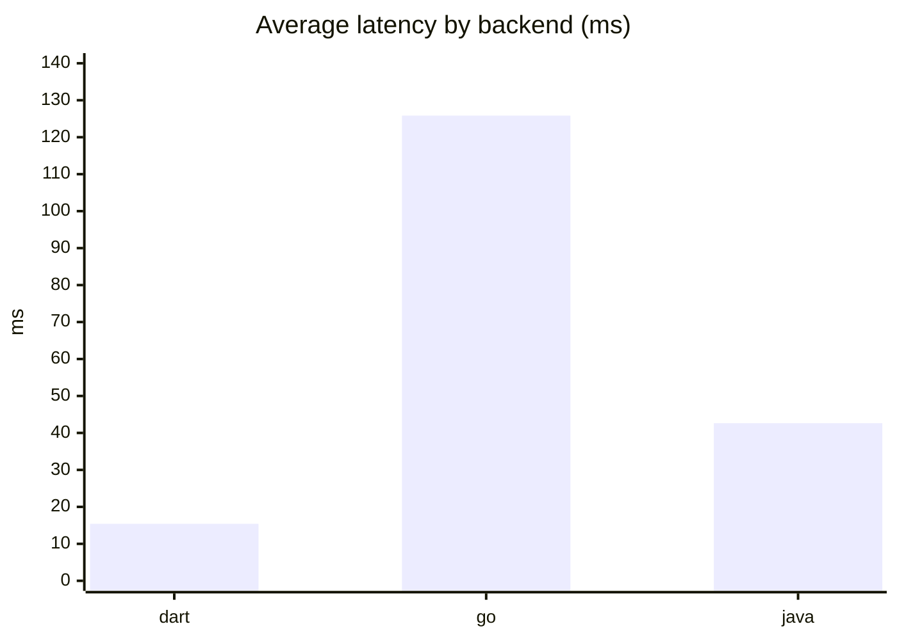
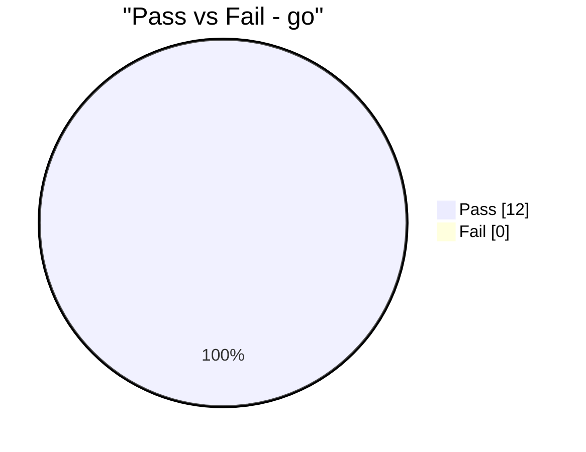
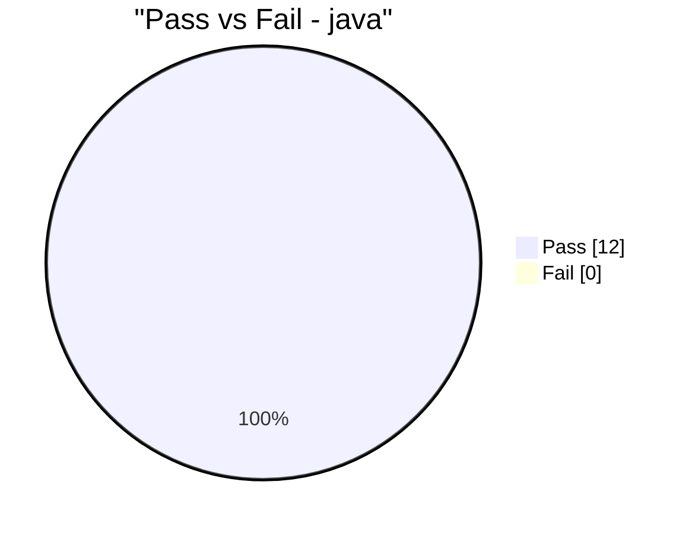

# Backend Benchmark Report

- Started (UTC): 2026-02-26T21:08:35.739089+00:00
- Finished (UTC): 2026-02-26T21:08:38.100683+00:00
- Raw data: reports/benchmark/benchmark_latest.json

## Backend Summary

| Backend | Total | Passed | Failed | Pass Rate (%) | Avg (ms) | P95 (ms) |
|---|---:|---:|---:|---:|---:|---:|
| dart | 12 | 12 | 0 | 100.0 | 15.409 | 80.037 |
| go | 12 | 12 | 0 | 100.0 | 125.842 | 748.265 |
| java | 12 | 12 | 0 | 100.0 | 42.625 | 168.398 |

## Charts

## Endpoint Results

| Backend | Endpoint | Method | Path | Runs | Passed | Pass Rate (%) | Avg (ms) | P95 (ms) | Last Status |
|---|---|---|---|---:|---:|---:|---:|---:|---:|
| dart | create_todo | POST | /api/todos | 1 | 1 | 100.0 | 3.411 | 3.411 | 200 |
| dart | delete_todo | DELETE | /api/todos/08395dda-ddcf-43ca-adcd-74cefd6fad3c | 1 | 1 | 100.0 | 2.241 | 2.241 | 200 |
| dart | get_todo | GET | /api/todos/08395dda-ddcf-43ca-adcd-74cefd6fad3c | 1 | 1 | 100.0 | 2.739 | 2.739 | 200 |
| dart | list_todos | GET | /api/todos | 1 | 1 | 100.0 | 3.119 | 3.119 | 200 |
| dart | list_todos [bench] | GET | /api/todos | 5 | 5 | 100.0 | 2.127 | 2.391 | 200 |
| dart | login | POST | /auth/login | 1 | 1 | 100.0 | 77.772 | 77.772 | 200 |
| dart | register | POST | /auth/register | 1 | 1 | 100.0 | 82.806 | 82.806 | 200 |
| dart | update_todo | PUT | /api/todos/08395dda-ddcf-43ca-adcd-74cefd6fad3c | 1 | 1 | 100.0 | 2.178 | 2.178 | 200 |
| go | create_todo | POST | /api/ | 1 | 1 | 100.0 | 1.832 | 1.832 | 201 |
| go | delete_todo | DELETE | /api/32aaff91-fd6e-4249-a2e7-8d3d94b544e4 | 1 | 1 | 100.0 | 1.527 | 1.527 | 200 |
| go | list_todos | GET | /api/ | 1 | 1 | 100.0 | 1.743 | 1.743 | 200 |
| go | list_todos [bench] | GET | /api/ | 5 | 5 | 100.0 | 0.817 | 0.897 | 200 |
| go | login | POST | /login | 1 | 1 | 100.0 | 744.733 | 744.733 | 200 |
| go | me | GET | /api/me | 1 | 1 | 100.0 | 1.943 | 1.943 | 200 |
| go | register | POST | /register | 1 | 1 | 100.0 | 752.582 | 752.582 | 201 |
| go | update_todo | PUT | /api/32aaff91-fd6e-4249-a2e7-8d3d94b544e4 | 1 | 1 | 100.0 | 1.664 | 1.664 | 200 |
| java | create_todo | POST | /api/todos | 1 | 1 | 100.0 | 16.209 | 16.209 | 201 |
| java | delete_todo | DELETE | /api/todos/6f6f1c6e-115f-41ad-9660-abb22a1675c0 | 1 | 1 | 100.0 | 11.259 | 11.259 | 200 |
| java | get_todo | GET | /api/todos/6f6f1c6e-115f-41ad-9660-abb22a1675c0 | 1 | 1 | 100.0 | 11.945 | 11.945 | 200 |
| java | list_todos | GET | /api/todos | 1 | 1 | 100.0 | 63.9 | 63.9 | 200 |
| java | list_todos [bench] | GET | /api/todos | 5 | 5 | 100.0 | 7.382 | 9.955 | 200 |
| java | login | POST | /auth/login | 1 | 1 | 100.0 | 87.543 | 87.543 | 200 |
| java | register | POST | /auth/register | 1 | 1 | 100.0 | 267.22 | 267.22 | 201 |
| java | update_todo | PUT | /api/todos/6f6f1c6e-115f-41ad-9660-abb22a1675c0 | 1 | 1 | 100.0 | 16.51 | 16.51 | 200 |
