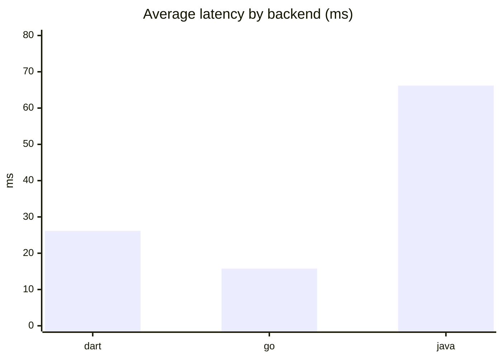
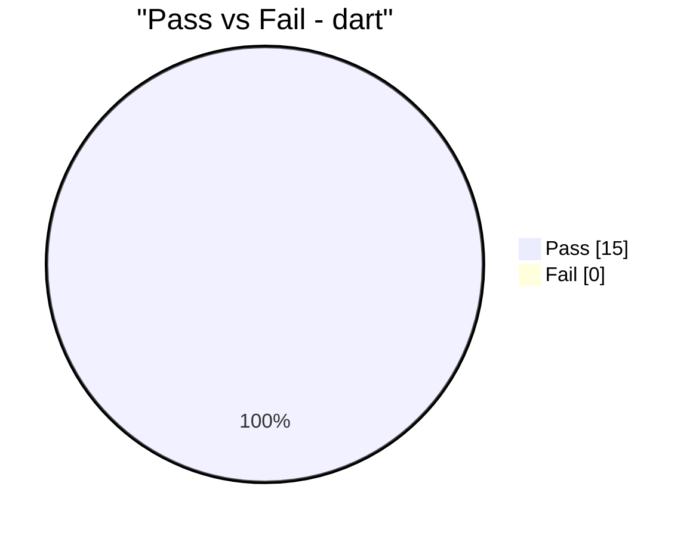
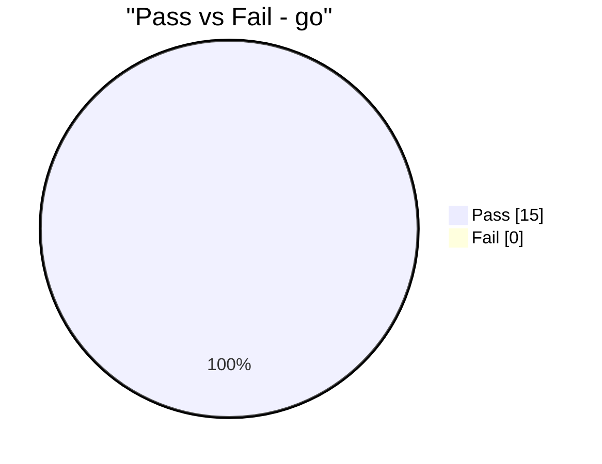

# Backend Benchmark Report

- Started (UTC): 2026-02-27T12:32:42.376519+00:00
- Finished (UTC): 2026-02-27T12:32:44.361463+00:00
- Raw data: reports/benchmark/benchmark_latest.json

## Backend Summary

| Backend | Total | Passed | Failed | Pass Rate (%) | Avg (ms) | P95 (ms) |
|---|---:|---:|---:|---:|---:|---:|
| dart | 15 | 15 | 0 | 100.0 | 26.16 | 159.675 |
| go | 15 | 15 | 0 | 100.0 | 15.755 | 104.432 |
| java | 15 | 15 | 0 | 100.0 | 66.194 | 244.708 |

## Legend

- **Total**: number of recorded HTTP attempts in that grouping (not unique endpoints).
- **Passed**: attempts that matched expected statuses for each endpoint.
- **Failed**: attempts with unexpected status or transport/runtime error.
- **Pass Rate (%)**: `Passed / Total * 100`.
- **Runs** (Endpoint Results): attempts executed for that specific endpoint row.
- **Warmup** calls are not recorded in totals; they are only used to stabilize measurements.
- **AUTH** suite includes `register`, `login`, `login_seed_fallback`, and `me`.
- **CRUD** suite includes todo read/write endpoints and benchmark list calls.

## Suite Summary (AUTH vs CRUD)

| Backend | Suite | Total | Passed | Failed | Pass Rate (%) | Avg (ms) | P95 (ms) |
|---|---|---:|---:|---:|---:|---:|---:|
| dart | AUTH | 2 | 2 | 0 | 100.0 | 163.533 | 172.214 |
| dart | CRUD | 13 | 13 | 0 | 100.0 | 5.025 | 9.501 |
| go | AUTH | 3 | 3 | 0 | 100.0 | 72.655 | 114.967 |
| go | CRUD | 12 | 12 | 0 | 100.0 | 1.53 | 3.518 |
| java | AUTH | 2 | 2 | 0 | 100.0 | 295.779 | 410.689 |
| java | CRUD | 13 | 13 | 0 | 100.0 | 30.873 | 70.39 |

## Charts

## Endpoint Results

| Backend | Endpoint | Method | Path | Runs | Passed | Pass Rate (%) | Avg (ms) | P95 (ms) | Last Status |
|---|---|---|---|---:|---:|---:|---:|---:|---:|
| dart | create_todo | POST | /api/todos | 1 | 1 | 100.0 | 7.274 | 7.274 | 200 |
| dart | delete_todo | DELETE | /api/todos/634fbf41-7c83-4810-9225-6b4a5eabd765 | 1 | 1 | 100.0 | 3.779 | 3.779 | 200 |
| dart | get_todo | GET | /api/todos/634fbf41-7c83-4810-9225-6b4a5eabd765 | 1 | 1 | 100.0 | 3.622 | 3.622 | 200 |
| dart | list_todos | GET | /api/todos | 1 | 1 | 100.0 | 7.581 | 7.581 | 200 |
| dart | list_todos [bench] | GET | /api/todos | 8 | 8 | 100.0 | 4.785 | 9.699 | 200 |
| dart | login | POST | /auth/login | 1 | 1 | 100.0 | 153.887 | 153.887 | 200 |
| dart | register | POST | /auth/register | 1 | 1 | 100.0 | 173.179 | 173.179 | 200 |
| dart | update_todo | PUT | /api/todos/634fbf41-7c83-4810-9225-6b4a5eabd765 | 1 | 1 | 100.0 | 4.791 | 4.791 | 200 |
| go | create_todo | POST | /api/ | 1 | 1 | 100.0 | 3.988 | 3.988 | 201 |
| go | delete_todo | DELETE | /api/7a6d8c42-4b3f-4f5e-bd8d-90e1b5674f6c | 1 | 1 | 100.0 | 2.143 | 2.143 | 200 |
| go | list_todos | GET | /api/ | 1 | 1 | 100.0 | 1.406 | 1.406 | 200 |
| go | list_todos [bench] | GET | /api/ | 8 | 8 | 100.0 | 0.962 | 1.06 | 200 |
| go | login | POST | /login | 1 | 1 | 100.0 | 99.164 | 99.164 | 200 |
| go | me | GET | /api/me | 1 | 1 | 100.0 | 2.079 | 2.079 | 200 |
| go | register | POST | /register | 1 | 1 | 100.0 | 116.723 | 116.723 | 201 |
| go | update_todo | PUT | /api/7a6d8c42-4b3f-4f5e-bd8d-90e1b5674f6c | 1 | 1 | 100.0 | 3.133 | 3.133 | 200 |
| java | create_todo | POST | /api/todos | 1 | 1 | 100.0 | 64.162 | 64.162 | 201 |
| java | delete_todo | DELETE | /api/todos/b6d39a0b-1cd5-4529-85be-09275b15e3dc | 1 | 1 | 100.0 | 44.654 | 44.654 | 200 |
| java | get_todo | GET | /api/todos/b6d39a0b-1cd5-4529-85be-09275b15e3dc | 1 | 1 | 100.0 | 29.187 | 29.187 | 200 |
| java | list_todos | GET | /api/todos | 1 | 1 | 100.0 | 79.732 | 79.732 | 200 |
| java | list_todos [bench] | GET | /api/todos | 8 | 8 | 100.0 | 18.264 | 24.764 | 200 |
| java | login | POST | /auth/login | 1 | 1 | 100.0 | 168.102 | 168.102 | 200 |
| java | register | POST | /auth/register | 1 | 1 | 100.0 | 423.457 | 423.457 | 201 |
| java | update_todo | PUT | /api/todos/b6d39a0b-1cd5-4529-85be-09275b15e3dc | 1 | 1 | 100.0 | 37.501 | 37.501 | 200 |
