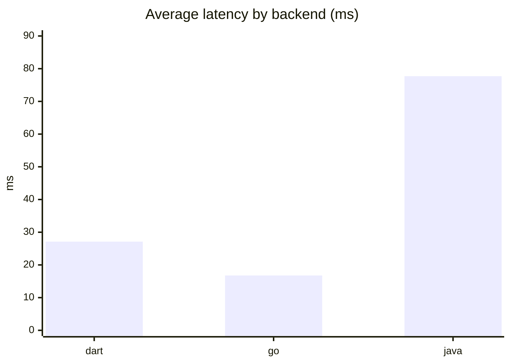
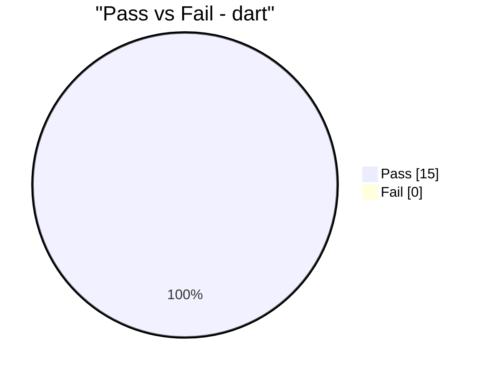
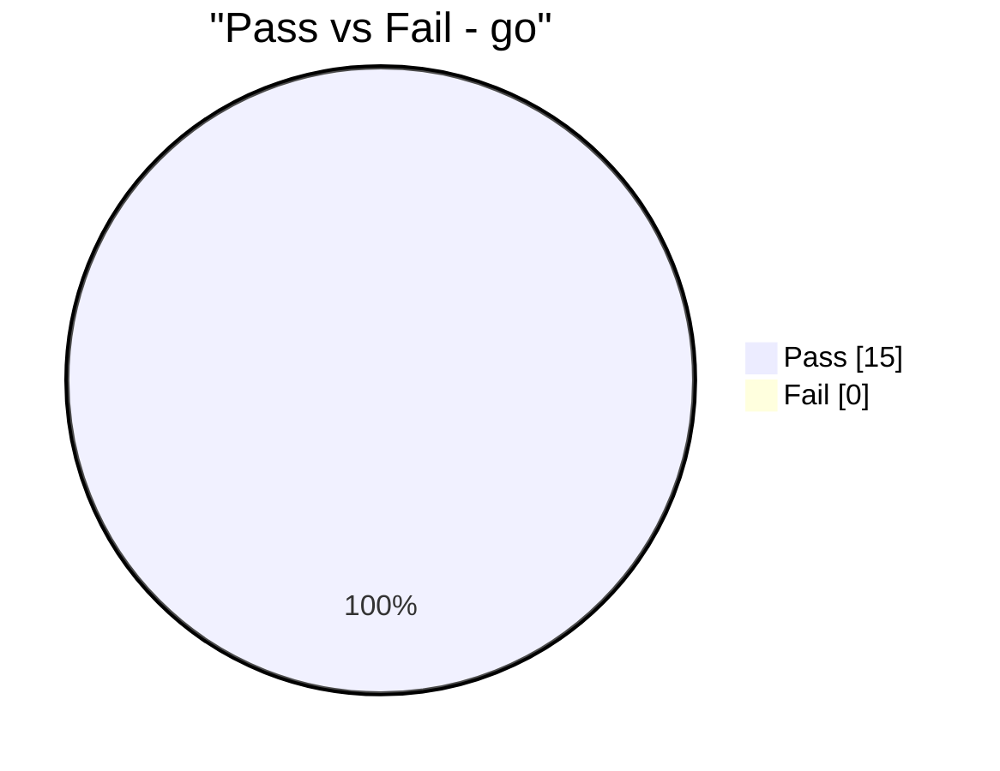

# Backend Benchmark Report

- Started (UTC): 2026-02-27T12:11:26.928645+00:00
- Finished (UTC): 2026-02-27T12:11:29.287710+00:00
- Raw data: reports/benchmark/benchmark_latest.json

## Backend Summary

| Backend | Total | Passed | Failed | Pass Rate (%) | Avg (ms) | P95 (ms) |
|---|---:|---:|---:|---:|---:|---:|
| dart | 15 | 15 | 0 | 100.0 | 27.127 | 162.766 |
| go | 15 | 15 | 0 | 100.0 | 16.768 | 109.437 |
| java | 15 | 15 | 0 | 100.0 | 77.714 | 293.553 |

## Suite Summary (AUTH vs CRUD)

| Backend | Suite | Total | Passed | Failed | Pass Rate (%) | Avg (ms) | P95 (ms) |
|---|---|---:|---:|---:|---:|---:|---:|
| dart | AUTH | 2 | 2 | 0 | 100.0 | 163.714 | 165.845 |
| dart | CRUD | 13 | 13 | 0 | 100.0 | 6.114 | 11.031 |
| go | AUTH | 3 | 3 | 0 | 100.0 | 75.722 | 118.174 |
| go | CRUD | 12 | 12 | 0 | 100.0 | 2.03 | 4.573 |
| java | AUTH | 2 | 2 | 0 | 100.0 | 358.817 | 505.659 |
| java | CRUD | 13 | 13 | 0 | 100.0 | 34.467 | 110.333 |

## Charts

## Endpoint Results

| Backend | Endpoint | Method | Path | Runs | Passed | Pass Rate (%) | Avg (ms) | P95 (ms) | Last Status |
|---|---|---|---|---:|---:|---:|---:|---:|---:|
| dart | create_todo | POST | /api/todos | 1 | 1 | 100.0 | 6.621 | 6.621 | 200 |
| dart | delete_todo | DELETE | /api/todos/16c770f0-f9d0-4a93-8688-41c9a295d78a | 1 | 1 | 100.0 | 3.698 | 3.698 | 200 |
| dart | get_todo | GET | /api/todos/16c770f0-f9d0-4a93-8688-41c9a295d78a | 1 | 1 | 100.0 | 3.702 | 3.702 | 200 |
| dart | list_todos | GET | /api/todos | 1 | 1 | 100.0 | 9.397 | 9.397 | 200 |
| dart | list_todos [bench] | GET | /api/todos | 8 | 8 | 100.0 | 6.309 | 11.389 | 200 |
| dart | login | POST | /auth/login | 1 | 1 | 100.0 | 161.345 | 161.345 | 200 |
| dart | register | POST | /auth/register | 1 | 1 | 100.0 | 166.082 | 166.082 | 200 |
| dart | update_todo | PUT | /api/todos/16c770f0-f9d0-4a93-8688-41c9a295d78a | 1 | 1 | 100.0 | 5.595 | 5.595 | 200 |
| go | create_todo | POST | /api/ | 1 | 1 | 100.0 | 3.467 | 3.467 | 201 |
| go | delete_todo | DELETE | /api/4df92fd3-865d-4607-83d0-ae990cb66ada | 1 | 1 | 100.0 | 1.894 | 1.894 | 200 |
| go | list_todos | GET | /api/ | 1 | 1 | 100.0 | 5.925 | 5.925 | 200 |
| go | list_todos [bench] | GET | /api/ | 8 | 8 | 100.0 | 1.338 | 1.809 | 200 |
| go | login | POST | /login | 1 | 1 | 100.0 | 105.068 | 105.068 | 200 |
| go | me | GET | /api/me | 1 | 1 | 100.0 | 2.468 | 2.468 | 200 |
| go | register | POST | /register | 1 | 1 | 100.0 | 119.63 | 119.63 | 201 |
| go | update_todo | PUT | /api/4df92fd3-865d-4607-83d0-ae990cb66ada | 1 | 1 | 100.0 | 2.367 | 2.367 | 200 |
| java | create_todo | POST | /api/todos | 1 | 1 | 100.0 | 56.71 | 56.71 | 201 |
| java | delete_todo | DELETE | /api/todos/4b94eb62-b568-41d2-9679-ab32c42311a4 | 1 | 1 | 100.0 | 18.654 | 18.654 | 200 |
| java | get_todo | GET | /api/todos/4b94eb62-b568-41d2-9679-ab32c42311a4 | 1 | 1 | 100.0 | 38.803 | 38.803 | 200 |
| java | list_todos | GET | /api/todos | 1 | 1 | 100.0 | 190.768 | 190.768 | 200 |
| java | list_todos [bench] | GET | /api/todos | 8 | 8 | 100.0 | 14.044 | 19.426 | 200 |
| java | login | POST | /auth/login | 1 | 1 | 100.0 | 195.658 | 195.658 | 200 |
| java | register | POST | /auth/register | 1 | 1 | 100.0 | 521.975 | 521.975 | 201 |
| java | update_todo | PUT | /api/todos/4b94eb62-b568-41d2-9679-ab32c42311a4 | 1 | 1 | 100.0 | 30.787 | 30.787 | 200 |
